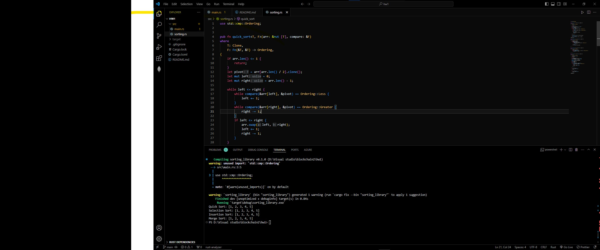

# Sorting Library

## Title
Sorting Library

## Usage
This Rust library provides implementations of various sorting algorithms, including quick sort, selection sort, insertion sort, and merge sort.

To use the library, simply import the desired sorting functions into your Rust project and call them with your data. See the examples below for details on how to use each sorting algorithm.

## Demo


## Examples
```rust
use sorting::{quick_sort, selection_sort, insertion_sort, merge_sort};
use std::cmp::Ordering;

fn main() {
    let mut nums = vec![4, 2, 5, 1, 3];
    quick_sort(&mut nums, &|a, b| a.cmp(b));
    println!("Quick Sort: {:?}", nums);

    let mut nums = vec![4, 2, 5, 1, 3];
    selection_sort(&mut nums, &|a, b| a.cmp(b));
    println!("Selection Sort: {:?}", nums);

    let mut nums = vec![4, 2, 5, 1, 3];
    insertion_sort(&mut nums, &|a, b| a.cmp(b));
    println!("Insertion Sort: {:?}", nums);

    let mut nums = vec![4, 2, 5, 1, 3];
    merge_sort(&mut nums, &|a, b| a.cmp(b));
    println!("Merge Sort: {:?}", nums);
}
