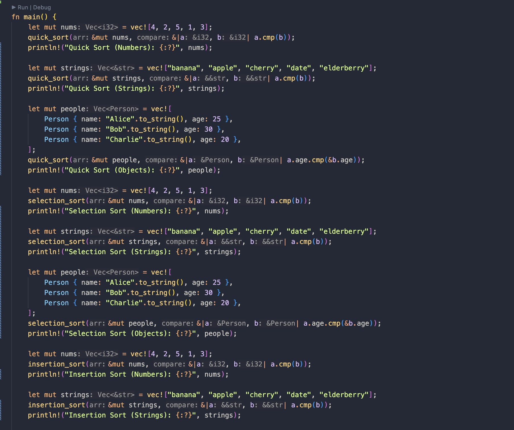
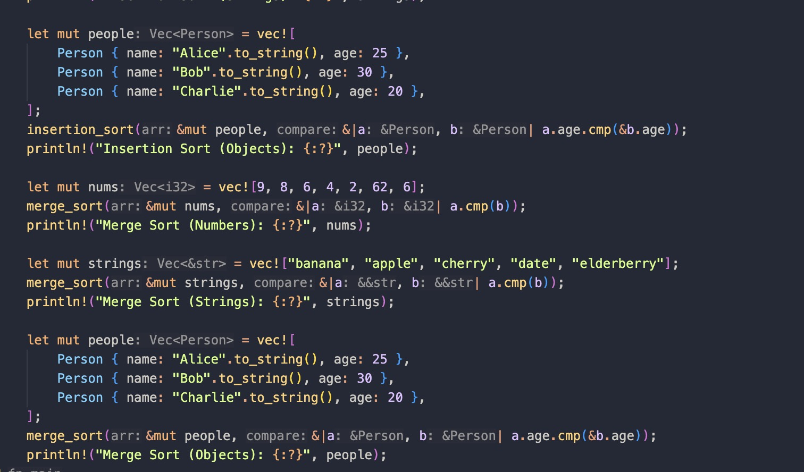
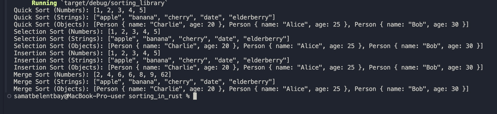

# Sorting Library

## Title
Sorting Library

## Overview
This Rust library offers a collection of sorting algorithms designed to efficiently organize data. It includes implementations of popular sorting techniques such as quick sort, selection sort, insertion sort, and merge sort.

## Features
- Quick Sort
- Selection Sort
- Insertion Sort
- Merge Sort

## Installation
To use this library in your Rust project, simply add the following line to your `Cargo.toml` file:


## Example




```toml
[dependencies]
sorting = "0.1.0"
